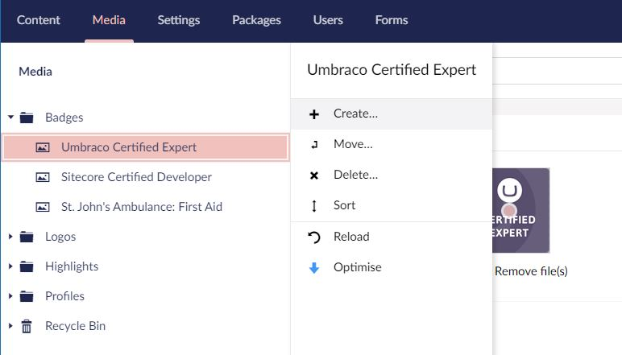
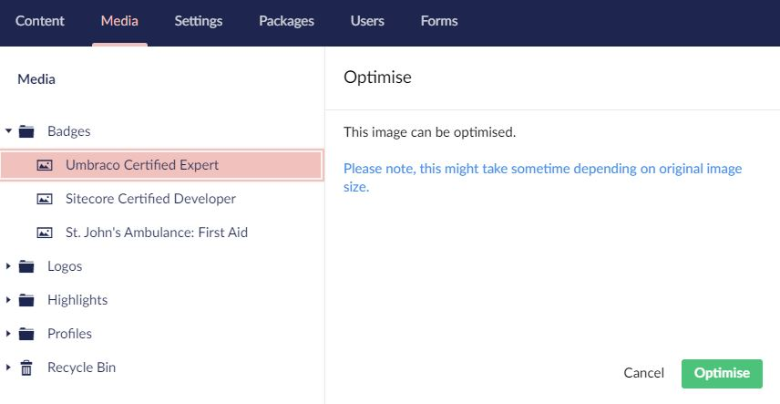

# punkOptimise

A simple plugin for Umbraco which allows you to optimise media using TinyPNG or ImageProcessor. 

# nuget

https://www.nuget.org/packages/punkOptimise.Core

`Install-Package punkOptimise.Core`

## Basic Requirements

- Umbraco 8.4+

## Screenshots

### Context Menu

### Action Menu

## Instructions
1. Install the nuget package: 

    `Install-Package punkOptimise.Core`
    
2. Add the following config to your web.config:

    `<add key="punkOptimise:ReduceFileExtensions" value="jpg,jpeg" />`

    `<add key="punkOptimise:ShrinkfileExtensions" value="png" />`

    `<add key="punkOptimise:DefaultQuality" value="70" />`

    `<add key="punkOptimise:TinyPng:ApiUrl" value="https://api.tinify.com/shrink" />`

    `<add key="punkOptimise:TinyPng:ApiKey" value="" />`

3. Complete the TinyPNG developer API key registration: https://tinypng.com/developers 
4. Add the key to the config above: punkOptimise:TinyPng:ApiKey

