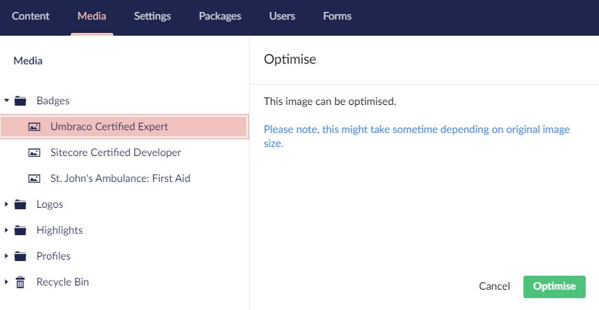

# punkOptimise

A simple app_plugin for Umbraco which allows you to optimise media using TinyPNG or ImageProcessor. 

## Basic Requirements

- Umbraco 8 +

## Screenshots

### Context Menu

### Action Menu

## Instructions
1. Copy the App_Plugins folder into your Umbraco website project. 
2. This will enable the optimise functionality in your Umbraco instance. 
3. Add the following config to your web.config:

    `<add key="punkOptimise:ReduceFileExtensions" value="jpg,jpeg" />`

    `<add key="punkOptimise:ShrinkfileExtensions" value="png" />`

    `<add key="punkOptimise:DefaultQuality" value="70" />`

    `<add key="punkOptimise:TinyPng:ApiUrl" value="https://api.tinify.com/shrink" />`

    `<add key="punkOptimise:TinyPng:ApiKey" value="XXXXXXXXXXXX" />`

4. Complete the TinyPNG developer API key registration: https://tinypng.com/developers and add the key to the config above.

